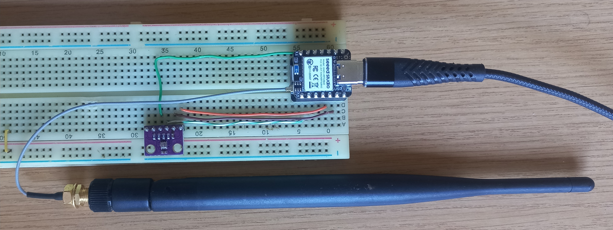
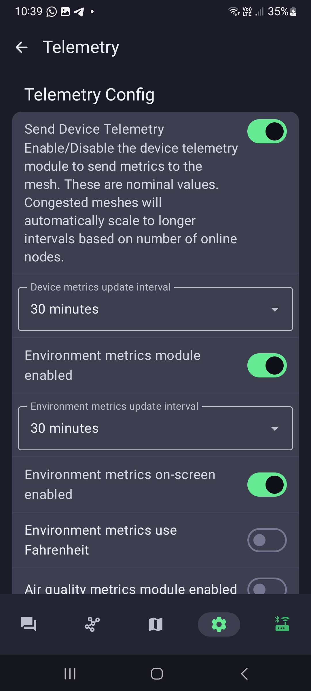
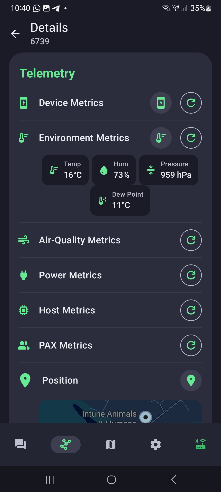
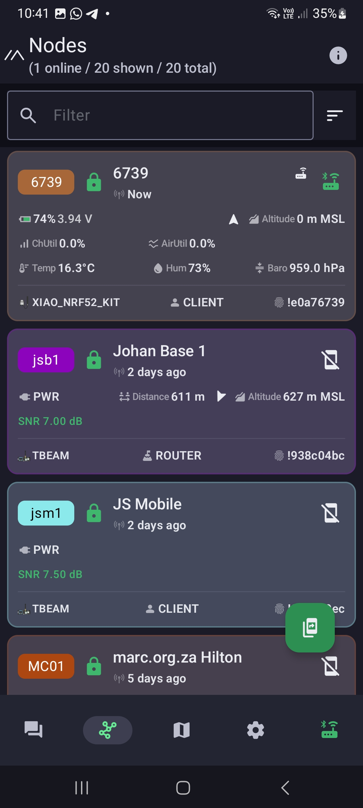

# XIAO nRF52840 & Wio-SX1262 Meshtastic with BMP280

A step-by-step guide to setting up a **Seeed Studio XIAO nRF52840** with a **Wio-SX1262** module to transmit environmental telemetry over Meshtastic using a **BMP280** sensor.

---

## 🛠️ Hardware Requirements

* **XIAO nRF52840 & Wio-SX1262**
* **BMP280 Sensor** *(Note: If you need humidity data in addition to temperature and pressure, use a BME280)*
* Breadboard
* Jumper wires

---

### 1. Prerequisites
Install [PlatformIO](https://platformio.org/) to build the required firmware binary.

### 2. Download Source Code
Create the working directory and clone the official Meshtastic repository:

``` bash
d:

md dir D:\MidlandsMountainMesh\meshtastic

cd D:\MidlandsMountainMesh\meshtastic

git clone https://github.com/meshtastic/firmware

cd D:\MidlandsMountainMesh\meshtastic\firmware
```

---

### 3. Build the Binary
Compile the binary configured with I2C support for the XIAO nRF52840:

```bash

pio run -e seeed_xiao_nrf52840_kit_i2c
```

### 4.Flash the Board

1. Connect the XIAO nRF52840 to your PC via USB.

2. Press the Reset button twice quickly to enter Device Firmware Upgrade (DFU) mode (the board will mount as a USB storage device).

3. Locate the compiled .uf2 file in the build output directory:

```bash
D:\MidlandsMountainMesh\meshtastic\firmware\.pio\build\seeed_xiao_nrf52840_kit_i2c\firmware-seeed_xiao_nrf52840_kit_i2c-2.8.0.6745995.uf2
```

4. Copy the .uf2 file to the mounted XIAO drive.

5. Once copying completes, reset and disconnect the XIAO.


## 🔌 Wiring Diagram

⚠️ Important: Ensure the board is disconnected from all power sources before making connections.

|**Xiao PIN**|**BMP280 PIN**|**Function**|
|--|---|---|
|3.3V|VCC|Power|
|GND|GND|Ground|
|D6|SDA|I2C Data|
|D7|SCL|I2C Clock|

<p align="center">
    
</p>


## ⚙️ Device Settings Configuration

Configure telemetry options using the Meshtastic Mobile App:

1. Connect to the node via BLE (Bluetooth).

2. Navigate to Settings ➔ Module Configuration ➔ Telemetry.

3. Apply the following settings:

    * Send Device Telemetry: Enabled

    * Device Metrics Update Interval: 30 minutes

    * Environment Metrics Module: Enabled

    * Environment Metrics Update Interval: 30 minutes

4. Tap Save.

<p align="center">
    
</p>

Your node will now broadcast environmental metrics over the mesh network every 30 minutes!

<p align="center">
    
    

</p>

```json
{
    "channel": 0,
    "from": 3769067321,
    "hop_start": 2,
    "hops_away": 0,
    "id": 2727750202,
    "payload": {
        "barometric_pressure": 959.635559082031,
        "relative_humidity": 86.45703125,
        "temperature": 15.2799997329712
    },
    "rssi": -73,
    "sender": "!938c04bc",
    "snr": 13.25,
    "timestamp": 1786692660,
    "to": 2475427004,
    "type": "telemetry"
}
```


